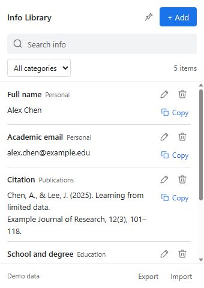

# Application Info Panel

[简体中文](README.zh-CN.md) · English

A compact Chrome extension for saving and copying frequently used information. Each entry has a **category, name and content**. Useful for application forms, citations, education, addresses and other personal facts.

The **340 × 480 toolbar popup** stores data locally. No account, server, analytics, page-reading permissions or automatic form filling.



## Download and install

Download a ZIP from this repository's **Releases** page:

- `application-info-panel-0.5.0-en.zip` — English interface.
- `application-info-panel-0.5.0-zh-CN.zip` — Simplified Chinese interface.

1. Extract the ZIP to a permanent folder.
2. Open `chrome://extensions` in Chrome 116 or later.
3. Turn on **Developer mode** and click **Load unpacked**.
4. Select the extracted folder containing `manifest.json`.
5. In Chrome's extensions menu, pin **Application Info Panel** (or **信息库** for Chinese).
6. Click its toolbar icon, then **Add** to save your first entry.

These are unpacked local installation packages, not Chrome Web Store listings. The interface language is fixed by the package you choose; saved user content is never translated.

## Features

- Custom categories, filtering and search across names, categories and content.
- One **Copy** button per entry: content only, including line breaks.
- Pencil and trash icons for editing and direct deletion with confirmation.
- JSON backup export and merge import; identical entries are skipped.
- Sequential writes and revision checks protect against stale edits.
- Light/dark appearance, keyboard navigation and Ctrl / ⌘ + K to search.
- **Pin**: click the pin beside Add to move into Chrome's persistent side panel. It stays open while you click webpages or switch tabs in the same window. Close it with the × in Chrome's side panel header. The default toolbar action still opens the small popup.

Click **Save** before closing the popup. Clicking outside closes it and discards unsaved edits. Chrome controls the popup's position near its toolbar icon.

## Data and updates

Entries use `chrome.storage.local` under `applicationInfoItems`. Normal popup or browser closure does not clear saved data. Uninstalling removes local data. Export backups regularly; JSON backups contain plain text.

To update or switch language, export a backup, copy the new package's files into the **same installation folder**, then click **Reload** in `chrome://extensions`. Keep that folder in place. Loading a different folder may create a separate extension with separate storage; transfer entries with JSON export/import. Both languages use compatible backups.

There is no notes field in the UI. Legacy notes remain in existing data and backups for compatibility.

## Development and reproducible packaging

Plain HTML/CSS/JavaScript, no npm dependencies. Node.js 24 runs tests; Python 3.10+ builds ZIPs using its standard library.

```sh
npm test
npm run build
npm run preview
```

`dist/` contains two unpacked folders, two ZIPs and `SHA256SUMS.txt`. The packager uses an explicit file list and fixed ZIP timestamps. Identical source and toolchain produce matching checksums. Browser data, test exports and local environment files are excluded.

Preview: `http://127.0.0.1:8765/popup.html?demo`. Fictional data stays in page memory and resets on refresh. Run `node tools/preview.cjs --language en` after building to preview English. Regular-tab previews do not test native popup anchoring or Chrome storage.

Optional Conda environment:

```sh
conda env create --prefix ./.conda --file environment.yml
conda activate ./.conda
```

`python tools/render-icons.py` regenerates the included PNGs using Pillow 12.2. Python and Conda are not needed to use the extension.

GitHub Actions runs tests and packages both languages. See [CHANGELOG.md](CHANGELOG.md) and [VALIDATION.md](VALIDATION.md) for changes and verification limits.

## Layout

- `application-info-panel/` — Chinese default source and manifest.
- `language.js`, `i18n.js` — package language and shared translations.
- `tests/` — model, storage, background and localization checks.
- `tools/build.py` — bilingual release packager.
- `tools/preview.cjs` — local preview server.

Chrome references: [Popup](https://developer.chrome.com/docs/extensions/reference/api/action#popup), [Storage](https://developer.chrome.com/docs/extensions/reference/api/storage).

Pinning adds the `sidePanel` permission. It does not add webpage access. Panel placement follows your Chrome side-panel setting. The installed extension is required; web previews only demonstrate the layouts. `sidepanel.html` is generated from the popup markup with `node tools/generate-panel.cjs` and shares the same scripts and storage.
