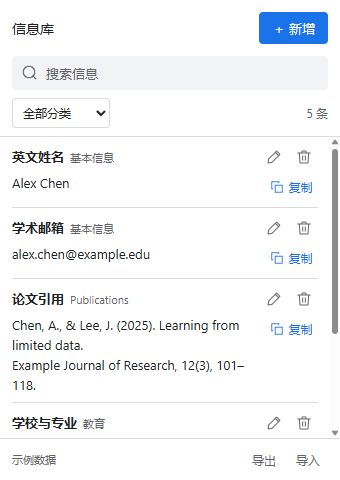

# 信息库 · Application Info Panel

简体中文 · [English](README.md)

一个简洁的 Chrome 信息库扩展，用来保存和复制需要反复填写的信息。每条记录只有 **分类、名称、内容**，适合申请表信息、论文引用、教育经历、地址等常用资料。

点击右上角图标打开 **340 × 480 的小弹窗**。数据保存在浏览器本地，无账号、服务器、统计服务、网页读取或自动填表。



## 下载和安装

从仓库的 **Releases** 页面下载：

- `application-info-panel-0.4.0-zh-CN.zip`：简体中文界面。
- `application-info-panel-0.4.0-en.zip`：英文界面。

1. 把 ZIP 解压到准备长期保留的文件夹。
2. 在 Chrome 114 或更新版本中打开 `chrome://extensions`。
3. 开启「开发者模式」，点击「加载已解压的扩展程序」。
4. 选择解压后包含 `manifest.json` 的文件夹。
5. 在右上角扩展程序菜单中固定「信息库」（英文版名为 Application Info Panel）。
6. 点击图标，再点「新增」保存第一条信息。

这是本地加载的扩展包，没有上架 Chrome 应用商店。界面语言由压缩包决定，保存的个人内容不会自动翻译。

## 功能

- 自定义分类、分类筛选和搜索，搜索范围包括名称、分类与内容。
- 每条信息只有一个「复制」按钮，仅复制内容，保留内部换行。
- 铅笔编辑、垃圾桶直接删除，删除需确认。
- JSON 备份导出和合并导入，自动跳过完全重复的记录。
- 顺序写入和修订检查，避免旧窗口覆盖新内容。
- 浅色 / 深色模式、键盘操作、Ctrl / ⌘ + K 聚焦搜索。

编辑后点击「保存信息」。点击弹窗外会关闭弹窗，未保存的修改不会保留。弹窗的位置由 Chrome 控制，靠近工具栏图标显示。

## 数据与更新

使用 `chrome.storage.local` 的 `applicationInfoItems` 保存数据。正常关闭弹窗或浏览器不会清空已保存的信息。卸载扩展会删除本地数据，请定期导出备份；备份为包含全部内容的明文 JSON。

更新版本或切换语言时，先导出备份，把新包的文件覆盖到**原安装文件夹**，然后在 `chrome://extensions` 点击「重新加载」。请保留安装文件夹的位置。从不同文件夹加载可能成为另一份独立扩展，需要导出 / 导入 JSON 转移信息。两种语言的备份互相兼容。

界面没有备注字段。旧记录的备注仍保存在数据和备份中，以兼容旧版本。

## 开发与可复现打包

原生 HTML/CSS/JavaScript，无 npm 依赖。Node.js 24 用于测试，Python 3.10+ 用标准库打包。

```sh
npm test
npm run build
npm run preview
```

构建结果在 `dist/`：中英文各一份解压目录和 ZIP，附 `SHA256SUMS.txt`。使用明确的文件清单和固定 ZIP 时间戳，相同源码及工具链可生成相同校验值。不包含浏览器个人数据、测试导出或本地环境。

预览：`http://127.0.0.1:8765/popup.html?demo`。使用虚构数据和页面内存，刷新即重置。打包后运行 `node tools/preview.cjs --language en` 可预览英文版。普通网页不能验证原生弹窗的锚定位置和 Chrome 存储。

需要 Conda 环境时：

```sh
conda env create --prefix ./.conda --file environment.yml
conda activate ./.conda
```

使用 `python tools/render-icons.py` 和 Pillow 12.2 可重新生成 PNG 图标。使用扩展无需安装 Python 或 Conda。

GitHub Actions 会运行测试并打包两种语言。变更和验证边界见 [CHANGELOG.md](CHANGELOG.md)、[VALIDATION.md](VALIDATION.md)。

Chrome 参考：[弹窗](https://developer.chrome.com/docs/extensions/reference/api/action#popup)、[本地存储](https://developer.chrome.com/docs/extensions/reference/api/storage)。
